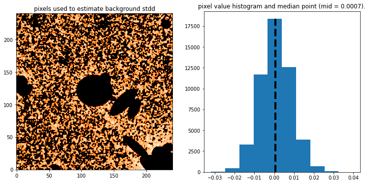

# galight - Galaxy shapes of Light
A Python-based open-source package that can be used to perform two-dimensional model fitting of optical and near-infrared images to characterize the light distribution of galaxies with components including a disk, bulge, bar and quasar.

Installation
------------
    $ git clone https://github.com/dartoon/galight <desired location>
    $ cd <desired location>
    $ python setup.py install --user

Additional Features
------------
* Search PSF stars in the FOV.

* Automatically Estimate the background noise level.

* Cutout the target object galaxies (QSOs) and prepare the materials to model the data.
* Detecting objects in the cutout stamp and quickly create Sersic keywords (in ``lenstronomy`` type) to model them.
* Model them QSOs and galaxies using 2D Sersic profile and scaled point source, based on [``lenstronomy``](https://github.com/sibirrer/lenstronomy).

Notebooks:
------------
The online documentation can be found in Read the Docs:
https://galight.readthedocs.io/

The notebooks of demonstrating how to use ``galight`` can be found in:
https://github.com/dartoon/galight_notebooks

The data used in the example notebook can be found [here](https://drive.google.com/file/d/1ZO9-HzV8K60ijYWK98jGoSoZHjIGW5Lc/view?usp=sharing).

Requirements
------------
packages including:
[``lenstronomy``](https://github.com/sibirrer/lenstronomy);
[``astropy``](https://github.com/astropy/astropy);
[``photutils``](https://github.com/astropy/photutils);
[``regions``](https://github.com/astropy/regions)
and related ones to be installed... 
